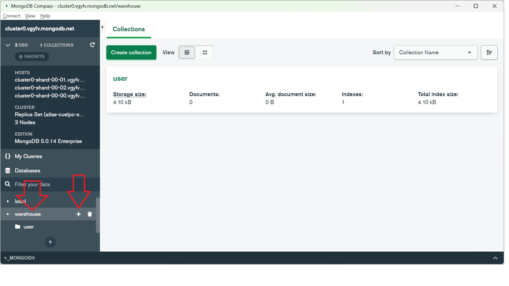

# MongoDB

MongoDB is a NoSQL databases, used in real time, big data and social media applications.

MongoDB makes use of records which are made up of documents that contain a data structure composed of field and value pairs.

The documents are similar to JavaScript Object Notation, but use a variant called Binary JSON (BSON).

MongoDB is really powerful to organize and save your data in a complex structure, called documents. MongoDB data will be stored into database that are composed by *collections*. Every *collection* contains documents. A *collection* can contains different structure of documents.
If you need you can strictly define the structure inside a document using *schemas* (we will see MongoDB *schema* when we will use the dependency "Mongoose".
*Schemas* allow you writing MongoDB validation and casting too.

# JSON
JSON (JavaScript Object Notation) is a lightweight data-interchange format. It is easy for humans to read and write. It is easy for machines to parse and generate. 

[Learn more about it.](https://www.json.org/json-en.html)

[A JSON formatter and validator](https://jsonformatter.curiousconcept.com)


# Start with Atals

Register an account for free on [MongoDB Atlas](https://www.mongodb.com/), and then create a new database, if you want to try for free, select a Shared one and check on the bottom if you are choosing a free hosting, then you can confirm the cluster creation.


Wait for the cluster to be ready and online, you can see it from the main dashboard.
Remember to check and modify, if you need, the Database access. Finally, select your connection method and use it. You can find help by clicking on the *Connect* button.


Note: a free cluster will be paused if you will not use it for a while, if that will happen, you can just login into your dashboard and resume it.


# Our use-case as example
We want to manage a warehouse database that contains various types of items.
So we will have:
- users composed by id, name, surname (and maybe the creation date?)
- an item is normally composed by id, label, price, and quantity that refer to the amount of item that is available in the warehouse
- an item can have information about its color
- an item can be a complex item that is composed of parts
- an item part is described by a label and can has 3 types of warning (battery warning, liquid warning, and glass warning)
- an item part can be composed of other parts
- user orders composed by id, user_id, array of item_it, a sent and a closed flag

# MongoDB Compass
Compass is an application that allows us to manage our MongoDB database, we will see how to create collections, insert data and query them with this application (note: compass can do more than that).
Download and install [MongoDB Compass](https://www.mongodb.com/try/download/compass).

Connect to your database using MongoDB Compass, remember that if you are using Atlas, you can generate the connection string with the *Connect* button.
Your connection string shoudl be like: `mongodb+srv://<username>:<password>@<hostname>/<database>`
(without `<` and `>`).


Create your first database, when you create a new database you need to create one collection too.
Following our use-case, we will create our database named "warehouse" with the first collection named "user".
For the creation of a collection, we don't need the structure or the schema of our documents that will be contained in the collection, in fact, Compas is asking us only for the collection name.


Clicking on the database name we can list our collections, clicking the "+" we can create a new collection inside the database. Now, create the others collection that we need: "item", and "order".


After that, you should able to see in the Composed dashboard the 3 collections.


Clicking on the collection in our Compass dashboard will give us the functionalities to populate, and query our selected collection.

Let's create some users.


Here is a JSON that contains our first user (you can omit the _id that will automatically generate)
```
{
  "name":"pluto",  
  "surname":"rossi"
}
```


Let's populate some items, and note that the items' document structure will be different, we will create items, colored items and complex items.
```
{
  "label":"battery",
  "price":2.5,
  "quantity":10  
}
```
```
{
  "label":"computer",
  "price":1696,
  "quantity":3,
  "parts":[
    { 
        "label":"ram",
        "price":64,
        "quantity":4  
    },
    { 
        "label":"cpu",
        "price":320,
        "quantity":1
    },
    { 
        "label":"graphic card",
        "price":800,
        "quantity":1
    },
    { 
        "label":"motherboard",
        "price":120,
        "quantity":1
    },
    { 
        "label":"case",
        "price":50,
        "quantity":1
    },
    { 
        "label":"power supply",
        "price":150,
        "quantity":1
    }
  ]
}
```
```
{
    "label":"pc portable",
    "price":1200,
    "quantity":2,
    "color":"red"
}
```
```
{
    "label":"pc portable",
    "price":1200,
    "quantity":3,
    "color":"blue"
}
```
```
{
    "label":"pc portable with cover",
    "price":1250,
    "quantity":1,
    "color":"blue",
    "parts":[
        {
            "label":"pc portable",
            "price":1200,
            "quantity":1,
            "color":"blue"
        },
        {
            "label":"cover",
            "price":50,
            "quantity":1,
            "color":"blue"
        }
    ]
}
```

You can see your documents with different visualization options.


Now let's try a simple query:`{label:"pc portable"}`
The query language is based on JavaScript.


Other examples of query:
- `{"parts.label":"ram"}`
- `{"parts": { $size: 2 } }`
- `{"parts":{$gt: {$size: 1}}}`
- `{"price":{$lte: 200}}`

# Node.js
Node.js is a cross-platform, open-source server environment.
It is used for server-side programming, and primarily deployed for non-blocking, event-driven servers.

NPM (Node Package Manager) is used to manage the dependecies of your node.js service (Mongoose is a dependecy).

Coding with node.js, [example and explanation](./nodejs/README.md)

Create a new node.js project.
- create a new directory and inside run `npm init`
- install our dependency `npm i -s express`, `npm i -s cors`, and `npm i -s mongoose`
- create the entry point file, as an example `index.js`
- let's coding

If you want to use the node project inside this repo, go into [warehouse](./warehouse/) then
- run `npm install`
- change your DB connection string (first line `const DB`)
- run `node ./index.js`

Now you can try those URLs on your browser:
 - `http://localhost:4000/hello`
 - `http://localhost:4000/hello?name=Andrea`

# MongoDB schema
A schema is a JSON object that defines the the structure and contents of your data, to define your application's data model and validate documents whenever they're created, changed, or deleted.

We decide to use the scheme for the collections 'user' and 'order' but not for 'item'.
In order to skip the document schema validation use `{ strict: false }` as a parameter of the Schema.

# project goals

- route to list users
- route to list orders
- route to get an item by ID
- route to add a user
- route to add order
- route to add item


