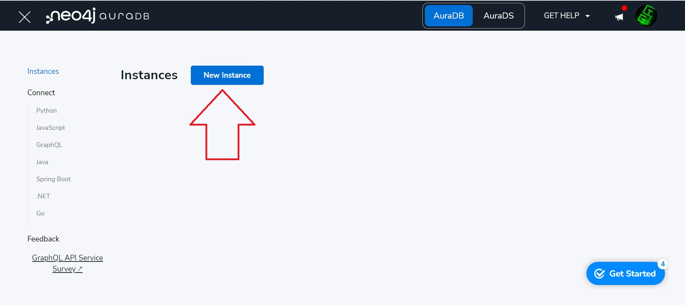
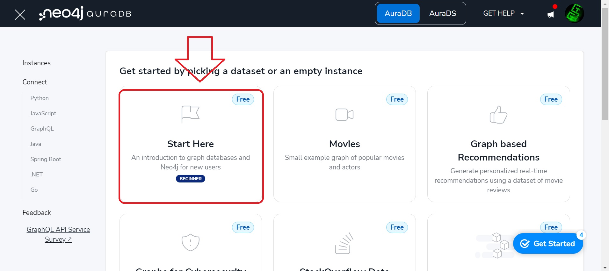
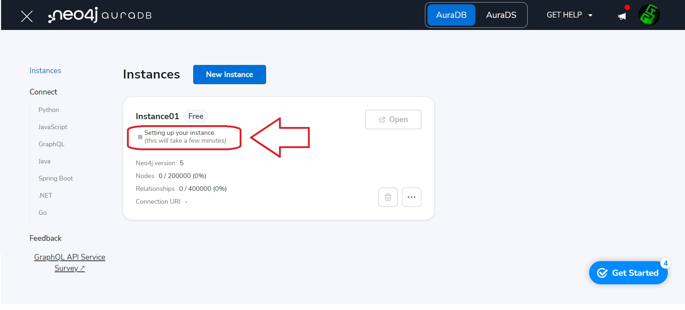
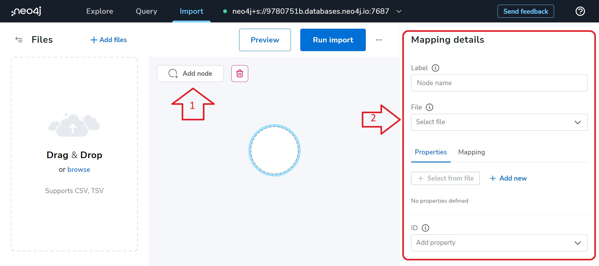
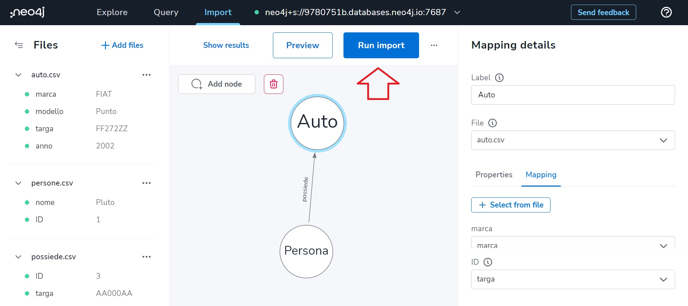
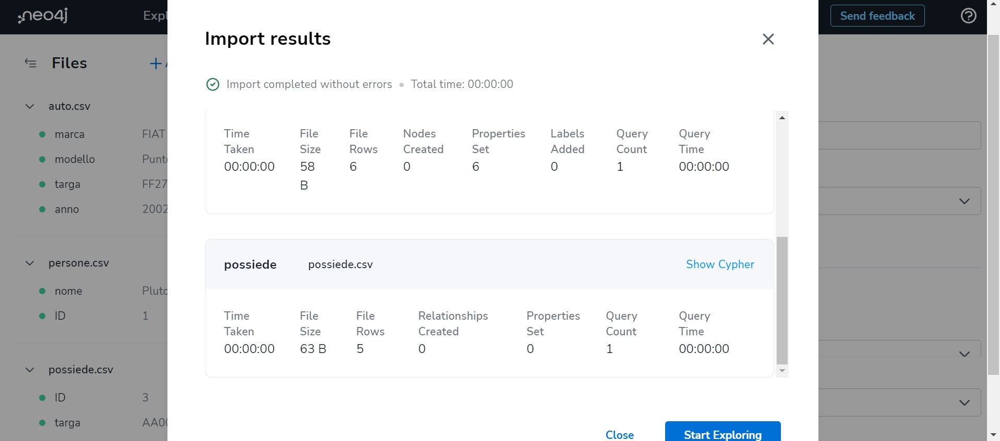
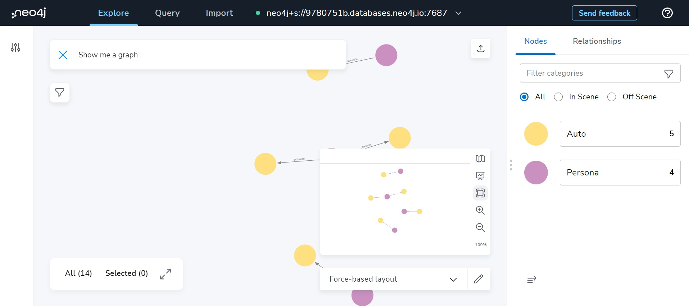
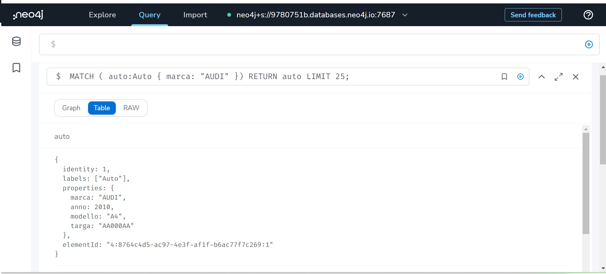
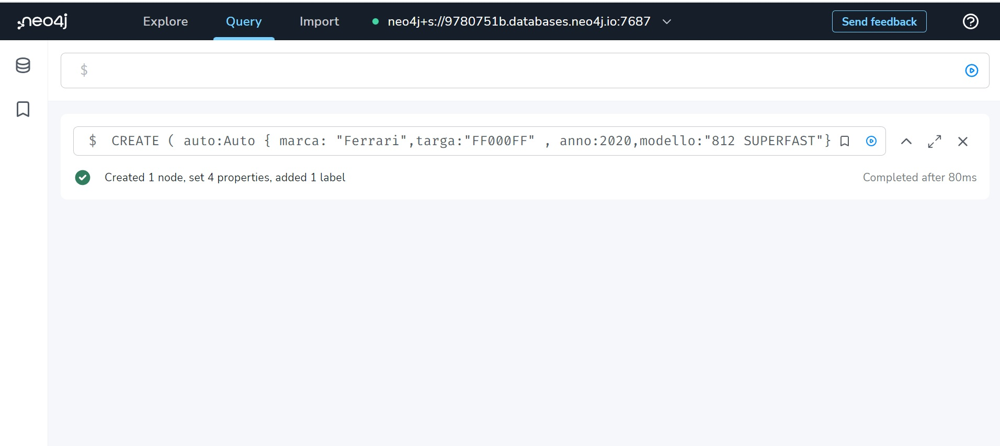
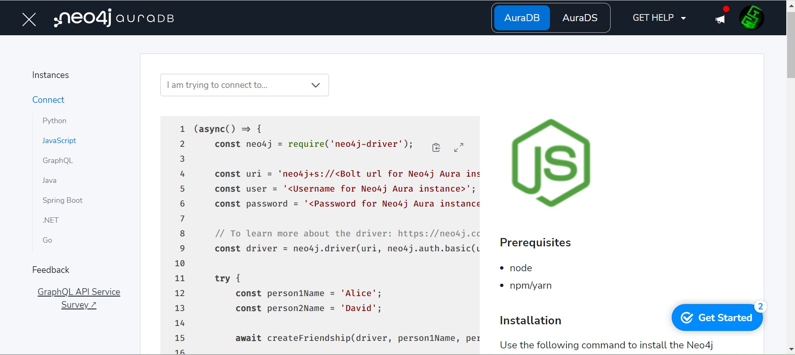

# Neo4J

[Neo4J official guide](https://neo4j.com/developer/get-started/)

Neo4J is a native graph database. A Neo4J database is a collection of nodes, and every node can be linked to the other through relations. This allows you to query the database with a complex relation request among the data, faster than other databses (Neo4J relations vs index).


# The Property Graph Model
In Neo4j, information is organized as nodes, relationships, and properties. Nodes are the entities in the graph.

- Nodes can be tagged with labels, representing their different roles in your domain. (For example, Person).
- Nodes can hold any number of key-value pairs, or properties. (For example, name)
- Node labels may also attach metadata (such as index or constraint information) to certain nodes.

Relationships provide directed, named, connections between two node entities (e.g. Person LOVES Person).

- Relationships always have a direction, a type, a start node, and an end node, and they can have properties, just like nodes.
- Nodes can have any number or type of relationships without sacrificing performance.
- Although relationships are always directed, they can be navigated efficiently in any direction.
If you’d like to learn more about any of these, you can read more about Graph Data Modeling.

# Create your Neo4J database

[register an account](https://neo4j.com/cloud/platform/aura-graph-database/?ref=developer-guides)

Create a new instance



Wait until the instance is ready, and when the status will be "running" click on "Open".

In the new tab that will open on your browser, accept the policy and insert your password (the password that you should saved at the creation of the database instance).

Now you should see the web interface that will allow us to create nodes!
Let's create some nodes, by clicking on "Add node" and then filling in the menu on the right that will open.
That part is about data modelization, you need to create nodes and relations structure.
Then you can import CSV files, that contain your data (like a table) for each node and relation.

In that example we need to import 3 files:
- [auto](./auto.csv) That contains cars (nodes instance)
- [persone](./persone.csv) That contains people (nodes instance)
- [possiede](./possiede.csv) That contains possession relations between the 2 types  of nodes "persone" and "auto"

Remember to link/map these files to your model, if you don't make mistake you will able to finalize the import of your data!



Now you can explore your data

and query your database 
```
MATCH ( auto:Auto { marca: "AUDI" }) RETURN auto LIMIT 25;
```


Add a new car..
```
CREATE ( auto:Auto { marca: "Ferrari",targa:"FF000FF" , anno:2020,modello:"812 SUPERFAST"})
```



Neo4J allow us to use Graphql too, you can find the guide [here](https://neo4j.com/docs/graphql-manual/current/queries/).
You can find help for conneting your Neo4J Database in the main dashoard.


