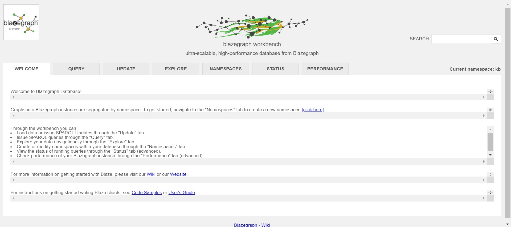
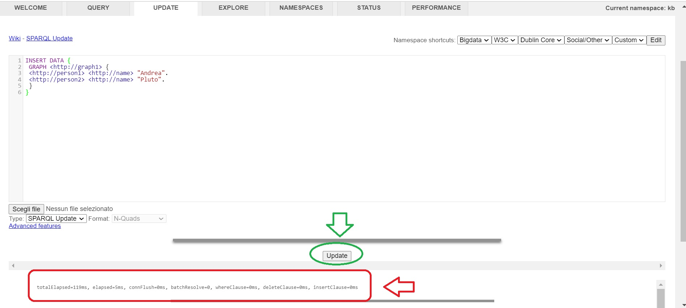
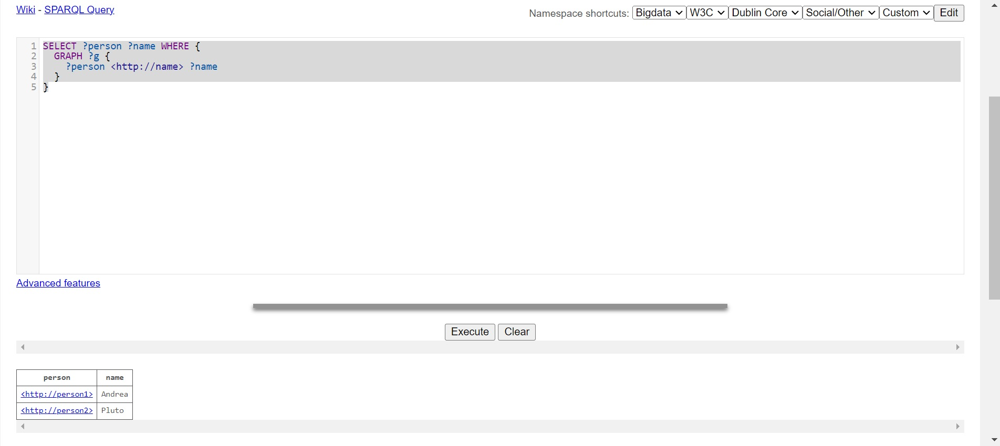

# Resource Description Framework (RDF)
RDF is a standard model for data interchange on the Web. RDF has features that facilitate data merging even if the underlying schemas differ, and it specifically supports the evolution of schemas over time without requiring all the data consumers to be changed.

RDF extends the linking structure of the Web to use URIs to name the relationship between things as well as the two ends of the link (this is usually referred to as a “triple”). Using this simple model, it allows structured and semi-structured data to be mixed, exposed, and shared across different applications.

This linking structure forms a directed, labeled graph, where the edges represent the named link between two resources, represented by the graph nodes. This graph view is the easiest possible mental model for RDF and is often used in easy-to-understand visual explanations.

In an easy way, we can describe RDF knowledge as a triple that is contained in a graph, and a graph can be linked by a triple. Every triple is composed of "subject" "predicate" and "object". Subject and predicate are always URI and oject can be URI or datatype for example string or number.
There is a way to create a standard structure of RDF data, which is called ontology, which will define and explain how is organized your database (example: https://www.w3.org/TR/rdf-schema/).
RDF can use a prefix to write in a shorter way URI, as an example instead to write: `http://xmlns.com/foaf/0.1/name`, we define a prefix like: 
`PREFIX foaf:<http://xmlns.com/foaf/0.1/>`
and then we can use `foaf:name`.

RDF is the closest representation to the one used by ourselves to think and talk to others.

# SPARQL

SPARQL defines two types of requests, update and query.
Updates are used to insert or modify data.
Queries are used to read data.
There is more than one type of update (INSERT DATA, DELETE DATA, DELETE/INSERT, DELETE WHERE, INSERT WHERE) and query ( SELECT WHERE, ASK).

SPARQL uses the "?" to define variables that can be used inside requests (for example "?name" is a variable)

SPARQL has a lot of rules that can help you to build the request that you need as FILTER, OPTIONAL, UNION, ORDER BY, FROM, FROM NAMED, etc.

Standards references:
- [Sparql query documentation](https://www.w3.org/TR/rdf-sparql-query/)
- [Sparql update documentation](https://www.w3.org/TR/sparql11-update/)

# Blazegraph

Blazegraph is a graph database, we will see how to use it for work with RDF and SPARQL. Blazegraph is able as a Java application, that will expose a web interface.

Steps:
- download it: [Official Blazegraph site](https://blazegraph.com/)
- open a terminal and run it `java -jar blazegraph.jar`
- open the web interface at `http://localhost:9999/blazegraph/`
- Here we go, now we can ask for SPARQL query and updates


Try with the first update, open the "update" tab, write your SPARQL update, and then click on the "update" button (green in the picture below), then you should see the results statistic of your data or an error message if the update is wrong (red section in the picture below).
Query example code:
```
INSERT DATA {
 GRAPH <http://graph1> {
 <http://person1> <http://name> "Andrea". 
 <http://person2> <http://name> "Pluto".
 }
}
```


Let's query the database, open the "query" tab follow the same step as you did for the update.
Update example code:
```
SELECT ?person ?name WHERE {
  GRAPH ?g {
  	?person <http://name> ?name
  }
}
```


Now, we want to rename  "Pluto" to "Paperino", this is the update that we need:
```
DELETE {
 GRAPH ?g { 
 	<http://person2> <http://name> ?oldname.
 }
}
INSERT{
  GRAPH ?g { 
 	<http://person2> <http://name> "Paperino".
 }
} WHERE {
   GRAPH ?g { 
 	<http://person2> <http://name> ?oldname.
 }
}
```

Now, if we call again the previous query, we will see that the name is updated.